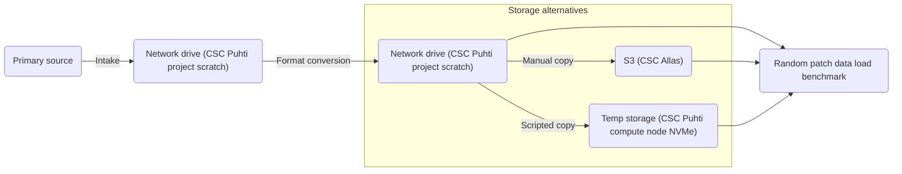
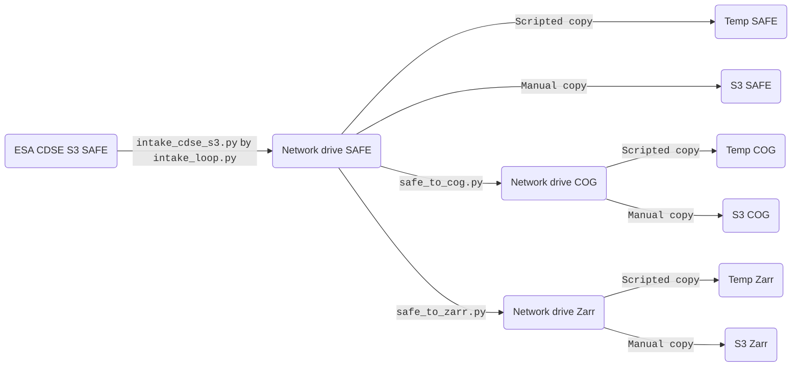

# datacube-storage-lab

Work in progress.

There is a need to evaluate storage systems (for us at HAMK, mainly those available on CSC – IT Center for Science, Finland supercomputer Puhti) and storage formats for multi-terabyte spatial data modalities for training and serving of machine learning (ML) models operating on multimodal geodata patch time series. In the present repository we provide Python code for intake of such data from external sources, for format conversion, and for benchmarking alternative storage systems and formats.

Data storage benchmark process diagram:



The storage systems that are compared are 1) a network drive (project scratch on CSC Puhti), 2) an S3 object storage (CSC Allas) that mirrors the network drive, and 3) a temp storage (CSC Puhti compute node's local NVMe) that is populated with data from the network drive. Different storage formats are also compared.

The use case that the benchmarking emulates is loading of randomly-located patch time series data for machine learning training. In the actual use case, each compute node may not load data from all satellite image tiles over Finland but from a single tile. Therefore, a temp storage need not be as large as the full data. Intake may store the data directly in the S3 storage rather than the network drive, in the format that is found to be the best.

## Prerequisites and configuration

We assume Python 3.11 or later.

### Local

For running locally, install dependencies:

TODO: add all dependencies.

```
pip install zarr xarray
```

### CSC Puhti

For running on CSC Puhti, this document assumes that the present repository is cloned to `/users/<USERNAME>/datacube-storage-lab` with your CSC username in place of the placeholder `<USERNAME>`, and that the Allas storage service is available to your project. If you clone the repository to another location, modify the paths given here accordingly.

Load the module dependencies and create a Python venv with a few upgraded packages:

```
module load allas
allas-conf --mode S3
module load geoconda
python3 -m venv --system-site-packages .venv
source .venv/bin/activate
pip install --upgrade zarr xarray
```

There may be some errors but that's OK as long as you get a "Successfully installed" last line about the upgraded packages.

The Allas mode will persist on successive jobs and you can also just use the same venv again (after module loads so that module packages don't mask venv packages):

```
module load allas
module load geoconda
source .venv/bin/activate
```

### Folder and S3 configuration

In the local clone of the present repository, create a file `.env` and configure in it environment variables specifying an S3 profile and data folders/buckets. Use the following template tailored for CSC Puhti nodes with NVMe temporary storage (with a placefolder `<PROJECT_NUMBER>` for your project number):

```
DSLAB_S2L1C_NETWORK_SAFE_PATH=/scratch/project_<PROJECT_NUMBER>/sentinel2_l1c_safe
DSLAB_S2L1C_NETWORK_COGS_PATH=/scratch/project_<PROJECT_NUMBER>/sentinel2_l1c_cogs
DSLAB_S2L1C_NETWORK_ZARR_PATH=/scratch/project_<PROJECT_NUMBER>/sentinel2_l1c_zarr
DSLAB_S2L1C_TEMP_SAFE_PATH="${LOCAL_SCRATCH}/sentinel2_l1c_safe"
DSLAB_S2L1C_TEMP_COGS_PATH="${LOCAL_SCRATCH}/sentinel2_l1c_cogs"
DSLAB_S2L1C_TEMP_ZARR_PATH="${LOCAL_SCRATCH}/sentinel2_l1c_zarr"
DSLAB_S2L1C_S3_PROFILE=s3allas
DSLAB_S2L1C_S3_SAFE_BUCKET=sentinel2_l1c_safe
DSLAB_S2L1C_S3_COGS_BUCKET=sentinel2_l1c_cogs
DSLAB_S2L1C_S3_ZARR_BUCKET=sentinel2_l1c_zarr
```

### Copernicus Data Space Ecosystem (CDSE) S3 API credentials

To use it as a primary source, Configure the ESA Copernicus Data Space Ecosystem (CDSE) S3 API endpoint in `~/.aws/config` under a "cdse" profile:

```
[profile cdse]
endpoint_url = https://eodata.dataspace.copernicus.eu
```

For the "cdse" profile, configure your CDSE S3 API credentials in `~/.aws/credentials`, filling in your access key and secret key (see [CDSE S3 API docs](https://documentation.dataspace.copernicus.eu/APIs/S3.html) on creating credentials) in place of the placeholders `<CDSE_ACCESS_KEY>` and `<CDSE_SECRET_KEY>`:

```
[cdse]
aws_access_key_id = <CDSE_ACCESS_KEY>
aws_secret_access_key = <CDSE_SECRET_KEY>
```

## Sentinel 2 L1C

For Sentinel 2 Level-1C products, we use the free ESA Copernicus Data Space Ecosystem (CDSE) APIS: STAC for tile-based searches and the S3 as the primary source of the data. We do not benchmark the CDSE S3 API because download quota limitations would prevent its use in the intended machine learning use case.

The Python scripts in the `sentinel2_l1c` folder handle intake and conversions. The intake and copying to 1) the network drive, 2) a compute node's Temp (typically fast NVMe storage on a compute node), and 3) S3 (CSC Allas) is done as follows:



The scripts should be launched from the repo root, for example:

```
python -m sentinel2_l1c.intake_loop
```

### Intake SAFE

`sentinel2_l1c.intake_cdse_s3` -- Download all images within a time range for a given tile using the CDSE STAC API and CDSE S3 API.

Example: Download all images from a single tile 35VLH from a single UTC day 2024-02-21:

```
python -m sentinel2_l1c.intake_cdse_s3 --tile_id 35VLH --time_start 2024-02-21T00:00:00Z time_end 2024-02-22T00:00:00Z
```

### Intake SAFE (loop)

Querying CDSE STAC API with a large time range brings uncertainties like hitting some API limit and could also lead to pagination of the results which would need to be handled. It is safer to just loop through the days and to make a separate query for each day.

`sentinel2_l1c.intake_loop` -- Download images for year 2024 for tile 35VLH, with each day queried separately.

Example:

```
python -m sentinel2_l1c.intake_loop
```

### Convert SAFE to COG

### Convert SAFE to Zarr

Zarr scheme:
* One group for each Sentinel 2 L1C location-tile id (for example 35VLH).
    - The original overlap of SAFE tiles is maintained.
    - When the region of interest (patch) intersects with tile overlaps, there will be multiple tiles available to the user to choose from, both having the same orbit number. It would make sense to create a tile
    + Easy to update when new tiles arrive.
    + No need to choose Zarr geographical area (such as Finland) beforehand
* One group for each year
    + No need to fix starting year
    - Last chunk will have nodata values when the number of satellite images is not divisible by chunk size (however it probably compresses away well)
    + This comes after location-tile id group, which is natural in our patch time-series use case.
* One group per resolution (10m, 20m, 60m)
* Time index chunk size: 10
* Band chunk size: the number of bands
* Y chunk size: 512
* X chunk size: 512

Building the Zarr is done the same way as updating it with fresh satellite images, one image at a time. Caching by the Zarr library will be used to reduce transfers (to?)/from the remote Zarr. (see https://github.com/zarr-developers/zarr-python/issues/1500)

### Copy data to S3

For benchmarking an S3 storage, first manually copy the data to S3. For CSC Allas:

TODO finalize

```
s3cmd put ..............
```

### Benchmark load times

On CSC Puhti, for benchmarking a compute node's local NVMe storage, the Slurm batch script below first copies the files to the NVMe. Fill in your CSC username and project number in place of the placeholders `<USERNAME>` and `<PROJECT_NUMBER>`.

```shell
#SBATCH --account=project_<PROJECT_NUMBER>
#SBATCH --job-name=dataload
#SBATCH --output=/scratch/project_<PROJECT_NUMBER>/dataload_%A.txt
#SBATCH --ntasks=1
#SBATCH --cpus-per-task=40
#SBATCH --mem=80G
#SBATCH --partition=small
#SBATCH --gres=nvme:750
#SBATCH --time=3:00:00

cd /users/<USERNAME>/datacube-storage-lab
module load geoconda
source ./.venv/bin/activate
rsync -r $DSLAB_S2L1C_NETWORK_SAFE_PATH/ $DSLAB_S2L1C_TEMP_SAFE_PATH
rsync -r $DSLAB_S2L1C_NETWORK_COGS_PATH/ $DSLAB_S2L1C_TEMP_COGS_PATH
rsync -r $DSLAB_S2L1C_NETWORK_ZARR_PATH/ $DSLAB_S2L1C_TEMP_ZARR_PATH
python3 ./sentinel2_l1c/patch_timeseries_benchmark.py
```

## Authors

Olli Niemitalo (Olli.Niemitalo@hamk.fi), Otto Rosenberg

## License

Licensed under the MIT license. We are probably happy to help if you need a different open license.

## Copyright

Copyright 2025 HAMK Häme University of Applied Sciences

## Acknowledgements

The work was supported by the Research Council of Finland funding decision 353076, Digital solutions to foster climate-smart agricultural transition (Digi4CSA). Development and testing were partially done on the CSC – IT Center for Science, Finland supercomputer Puhti.
