# datacube-storage-lab

There is a need to evaluate storage systems (for the authors of this repository, mainly those available on CSC – IT Center for Science, Finland supercomputer Puhti) and storage formats for multi-terabyte spatial data modalities for training and serving of machine learning (ML) models operating on multimodal geodata patch time series. In the present repository we provide Python code for intake of such data from external sources, for format conversion, and for benchmarking alternative storage systems and formats, concentrating on Sentinel 2 Level-1C data.

Data storage benchmark process diagram:

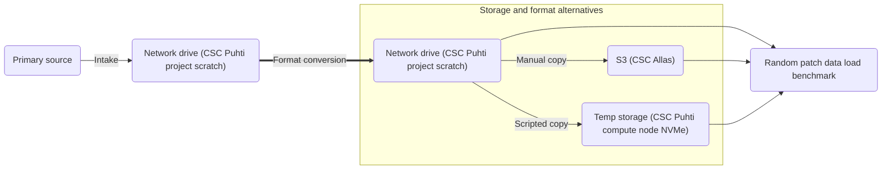

The storage systems that are compared are 1) a network drive (project scratch on CSC Puhti), 2) an S3 object storage (CSC Allas) that mirrors the network drive, and 3) a temp storage (CSC Puhti compute node's local NVMe) that is populated with data from the network drive. Different storage formats are also compared.

The use case that the benchmarking emulates is loading of randomly-located patch time series data for machine learning training. In the actual use case, each compute node may not load data from all satellite image tiles over Finland but from a single tile, or perhaps two tiles. Therefore, the temp storage need not be as large as the full data. Eventually, in machine learning training and serving, intake should store the data directly in the S3 storage rather than the network drive, in the format that is found to be the best in the current benchmarking.

## Prerequisites and configuration

We assume Python 3.11 or later.

### Local

For running locally in Ubuntu Linux, install dependencies:

```shell
sudo add-apt-repository ppa:ubuntugis/ppa
sudo apt update
sudo apt-get install python3-pip
sudo apt-get install gdal-bin libgdal-dev
sudo apt-get install s3cmd
sudo apt-get install zip
```

and pip packages (specifying the GDAL version you got from the above, for example `gdal==3.8.4`, if needed to resolve unmet dependencies):

```shell
pip install numpy zarr xarray pystac_client tenacity dotenv gdal rasterio python-openstackclient xmltodict rio-cogeo dask rioxarray progressbar2 s3fs==2025.3.0 boto3==1.35.36 aiobotocore==2.15.2 botocore==1.35.36
```

### CSC Puhti

For running on CSC Puhti, clone the repository for example to `~/datacube-storage-lab` and work from there. Ensure that the Allas storage service is available to your project (if not, apply). You can work from command line by starting an interactive job from the Puhti login node and waiting in the queue:
```shell
srun --account=project_<PROJECT_NUMBER> --job-name=dslab --ntasks=1 --cpus-per-task=4 --mem=12G --partition=small --time=7:00:00 --pty
```

Load module dependencies and create a Python venv with a few upgraded packages:
```shell
module load allas
module load geoconda
python3 -m venv --system-site-packages .venv
source .venv/bin/activate
pip install --upgrade zarr xarray dotenv python-openstackclient xmltodict rio-cogeo
```

There may be an error `ERROR: pip's dependency resolver does not currently take into account all the packages that are installed. This behaviour is the source of the following dependency conflicts.
wrf-python 1.3.4.1 requires basemap, which is not installed.` but that's OK as long as you get a `Successfully installed` last line about the upgraded packages.

On sucessive jobs, the Allas mode will persist and you can also just use the same venv again (after module loads so that module packages don't mask venv packages):
```shell
module load allas
module load geoconda
source .venv/bin/activate
```

### CSC Allas S3

To use Allas object storage from outside CSC Puhti, follow CSC's instructions on [*Configuring S3 connection on local computer*](https://docs.csc.fi/data/Allas/using_allas/s3_client/#getting-started-with-s3cmd). Warning: using `allas_conf` will overwrite any existing `~/.s3cfg` and `~/.aws/credentials`. For this reason it is better to configure Allas first and then configure other S3 credentials.

Configure Allas, specifying a persistent S3 mode rather than Swift mode:
```shell
allas-conf --mode S3
```

Move the Allas config from `~/.s3cfg` to `~/.s3allas` for clarity:
```shell
mv ~/.s3cfg ~/.s3allas
```

If you want to, you can rename `s3allas` to something else, in all occurrences in these instructions, including the value of the `DSLAB_S2L1C_S3_PROFILE` environment variable in the next subsection.

Edit `~/.aws/credentials` and change the heading `[default]` to `[s3allas]`.

Edit `~/.aws/config` and add a profile for Allas:

```
[profile s3allas]
endpoint_url = https://a3s.fi
```

### Copernicus Data Space Ecosystem (CDSE) S3 API credentials

To use ESA Copernicus Data Space Ecosystem (CDSE) S3 API as a primary source (as per the workflow documented here), configure its endpoint in `~/.aws/config` under a `cdse` profile. Edit the file and add:

```
[profile cdse]
endpoint_url = https://eodata.dataspace.copernicus.eu
```

For the `cdse` profile, configure your CDSE S3 API credentials by editing `~/.aws/credentials` and by adding the following, filling in your access key and secret key (see [CDSE S3 API docs](https://documentation.dataspace.copernicus.eu/APIs/S3.html) on creating credentials) in place of the placeholders `<CDSE_ACCESS_KEY>` and `<CDSE_SECRET_KEY>`:

```
[cdse]
aws_access_key_id = <CDSE_ACCESS_KEY>
aws_secret_access_key = <CDSE_SECRET_KEY>
```

### Environment variables and storage configuration

In the local clone of the present repository, create a file `.env` and configure in it environment variables specifying an S3 profile, data folders/buckets, and a result folder where timestamped result json files will be created by the benchmark. Use the following template tailored for CSC Puhti nodes with NVMe temporary storage (filling in the placefolder `<PROJECT_NUMBER>` for your project number):

```shell
DSLAB_S2L1C_NETWORK_SAFE_PATH=/scratch/project_<PROJECT_NUMBER>/sentinel2_l1c_safe
DSLAB_S2L1C_NETWORK_COG_PATH=/scratch/project_<PROJECT_NUMBER>/sentinel2_l1c_cog
DSLAB_S2L1C_NETWORK_ZARR_PATH=/scratch/project_<PROJECT_NUMBER>/sentinel2_l1c_zarr
DSLAB_S2L1C_NETWORK_ZIPZARR_PATH=/scratch/project_<PROJECT_NUMBER>/sentinel2_l1c_zipzarr.zip
DSLAB_S2L1C_TEMP_SAFE_PATH="${LOCAL_SCRATCH}/sentinel2_l1c_safe"
DSLAB_S2L1C_TEMP_COG_PATH="${LOCAL_SCRATCH}/sentinel2_l1c_cog"
DSLAB_S2L1C_TEMP_ZARR_PATH="${LOCAL_SCRATCH}/sentinel2_l1c_zarr"
DSLAB_S2L1C_TEMP_ZIPZARR_PATH="${LOCAL_SCRATCH}/sentinel2_l1c_zipzarr.zip"
DSLAB_S2L1C_S3_PROFILE=s3allas
DSLAB_S2L1C_S3_SAFE_BUCKET=sentinel2_l1c_safe
DSLAB_S2L1C_S3_COG_BUCKET=sentinel2_l1c_cog
DSLAB_S2L1C_S3_ZARR_BUCKET=sentinel2_l1c_zarr
DSLAB_S2L1C_S3_ZIPZARR_BUCKET=sentinel2_l1c_zipzarr
DSLAB_S2L1C_S3_ZIPZARR_KEY=sentinel2_l1c_zipzarr.zip
DSLAB_LOG_FOLDER=/scratch/project_<PROJECT_NUMBER>/dslab_logs
```

If you don't use CSC services, then change the folders and edit the value of `DSLAB_S2L1C_S3_PROFILE` so that an s3cmd configuration is found at `~/.<DSLAB_S2L1C_S3_PROFILE>` and a configuration and credentials to use with Boto3 are found in `~/.aws/config` under a heading `[profile <DSLAB_S2L1C_S3_PROFILE>]` and in `~/.aws/credentials` under a heading `[<DSLAB_S2L1C_S3_PROFILE>]` with the value of `DSLAB_S2L1C_S3_PROFILE` filled in place of the placeholder `<DSLAB_S2L1C_S3_PROFILE>`. See the above section *Copernicus Data Space Ecosystem (CDSE) S3 API credentials* for an example.


Use the environment variables from `.env` with subsequent commands, by entering:
```shell
set -a; source .env; set +a
```

Verify that the following command lists the environment variables:

```shell
env |grep DSLAB_
```

## Running individual modules

The Python modules in this repository typically have a `__main__` function and can therefore be launched from command line. In order to make the `.env` in the repo root findable by a module, the command line should be run from the repo root. For example, to run the module `sentinel2_l1c.intake_cdse_s3_year` which has source code in `sentinel2_l1c/intake_cdse_s3_year.py`:

```shell
python3 -m sentinel2_l1c.intake_cdse_s3_year
```

Typically you'd follow the workflow as given below. The documentation for each module can also be found after the workflow.

## Sentinel 2 L1C

For Sentinel 2 Level-1C products, we use the free ESA Copernicus Data Space Ecosystem (CDSE) APIS: STAC for tile-based searches and the S3 as the primary source of the data. We do not benchmark the CDSE S3 API because download quota limitations would prevent its use in the intended machine learning use case.

The Python scripts in the `sentinel2_l1c` folder handle intake, conversions, and random patch time series data load benchmarking. The intake and copying/format conversion to 1) the network drive, 2) a compute node's temp (typically fast NVMe storage on a compute node), and 3) S3 (CSC Allas) and benchmarking is done as follows:

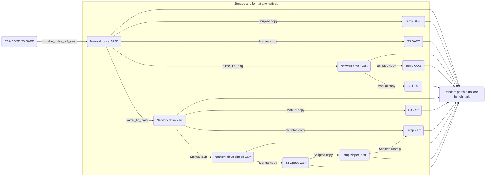

The standard workflow consists of of the following steps:
1. Sentinel 2 L1C SAFE intake: (slow!)
    ```shell
    # Intake
    python3 -m sentinel2_l1c.intake_cdse_s3_year   
    ```
2. Convert SAFE to COG and Zarr: (slow! conversion to Zarr takes almost 3 hours)
    ```shell
    # Convert network safe to network cog
    time python3 -m sentinel2_l1c.convert_safe_to_cog
    # Convert network safe to network zarr
    time python3 -m sentinel2_l1c.convert_safe_to_zarr
    ```
3. Manually zip the Zarr (takes almost 15 minutes):
    ```shell
    # Convert network zarr to network zipzarr
    (cd $DSLAB_S2L1C_NETWORK_ZARR_PATH && time zip -0 -r $DSLAB_S2L1C_NETWORK_ZIPZARR_PATH .)
    ```
4. Manually create S3 buckets for the data in different formats:
    ```shell
    # Create network safe bucket
    s3cmd -c ~/.$DSLAB_S2L1C_S3_PROFILE mb s3://$DSLAB_S2L1C_S3_SAFE_BUCKET
    # Create network cog bucket
    s3cmd -c ~/.$DSLAB_S2L1C_S3_PROFILE mb s3://$DSLAB_S2L1C_S3_COG_BUCKET
    # Create network zarr bucket
    s3cmd -c ~/.$DSLAB_S2L1C_S3_PROFILE mb s3://$DSLAB_S2L1C_S3_ZARR_BUCKET
    # Create network zipzarr bucket
    s3cmd -c ~/.$DSLAB_S2L1C_S3_PROFILE mb s3://$DSLAB_S2L1C_S3_ZIPZARR_BUCKET
    ```
    Or, if you have the buckets already, empty them before updating the data: (WARNING: destructive action)
    # Empty the network safe bucket
    s3cmd -c ~/.$DSLAB_S2L1C_S3_PROFILE del -rf s3://$DSLAB_S2L1C_S3_SAFE_BUCKET
    # Empty the network cog bucket
    s3cmd -c ~/.$DSLAB_S2L1C_S3_PROFILE del -rf s3://$DSLAB_S2L1C_S3_COG_BUCKET
    # Empty the network zarr bucket
    s3cmd -c ~/.$DSLAB_S2L1C_S3_PROFILE del -rf s3://$DSLAB_S2L1C_S3_ZARR_BUCKET
    # Empty the network zipzarr bucket
    s3cmd -c ~/.$DSLAB_S2L1C_S3_PROFILE del -rf s3://$DSLAB_S2L1C_S3_ZIPZARR_BUCKET
5. Manually copy the data to the S3 buckets and make them public: (slow, up to a few hours; under 2 hours for Zarr and under 1 hour for zipped Zarr from HAMK network)
    ```shell
    # Copy network safe to s3 safe
    time s3cmd -c ~/.$DSLAB_S2L1C_S3_PROFILE sync -P -r $DSLAB_S2L1C_NETWORK_SAFE_PATH/ s3://$DSLAB_S2L1C_S3_SAFE_BUCKET/
    # Copy network cog to s3 cog
    time s3cmd -c ~/.$DSLAB_S2L1C_S3_PROFILE sync -P -r $DSLAB_S2L1C_NETWORK_COG_PATH/ s3://$DSLAB_S2L1C_S3_COG_BUCKET/
    # Copy network zarr to s3 zarr
    time s3cmd -c ~/.$DSLAB_S2L1C_S3_PROFILE sync -P -r $DSLAB_S2L1C_NETWORK_ZARR_PATH/ s3://$DSLAB_S2L1C_S3_ZARR_BUCKET/
    # Copy network zipzarr to s3 zipzarr
    time s3cmd -c ~/.$DSLAB_S2L1C_S3_PROFILE sync -P $DSLAB_S2L1C_NETWORK_ZIPZARR_PATH s3://$DSLAB_S2L1C_S3_ZIPZARR_BUCKET/$DSLAB_S2L1C_S3_ZIPZARR_KEY
    # Make s3 safe bucket publicly readlable
    s3cmd -c ~/.$DSLAB_S2L1C_S3_PROFILE setpolicy public-read-policy.json s3://$DSLAB_S2L1C_S3_SAFE_BUCKET
    # Make s3 cog bucket publicly readlable
    s3cmd -c ~/.$DSLAB_S2L1C_S3_PROFILE setpolicy public-read-policy.json s3://$DSLAB_S2L1C_S3_COG_BUCKET
    # Make s3 zarr bucket publicly readlable
    s3cmd -c ~/.$DSLAB_S2L1C_S3_PROFILE setpolicy public-read-policy.json s3://$DSLAB_S2L1C_S3_ZARR_BUCKET
    # Make s3 zipzarr bucket publicly readlable
    s3cmd -c ~/.$DSLAB_S2L1C_S3_PROFILE setpolicy public-read-policy.json s3://$DSLAB_S2L1C_S3_ZIPZARR_BUCKET
    ```
    **Not usually needed**, but you can also copy back from S3 to network storage, useful if you did the earlier steps in another system: (slow, an hour or so at CSC Puhti)
    ```shell
    # Copy s3 safe to network safe
    mkdir -p $DSLAB_S2L1C_NETWORK_SAFE_PATH; time s3cmd -c ~/.$DSLAB_S2L1C_S3_PROFILE get -r s3://$DSLAB_S2L1C_S3_SAFE_BUCKET/ $DSLAB_S2L1C_NETWORK_SAFE_PATH/
    # Copy s3 cog to network cog
    mkdir -p $DSLAB_S2L1C_NETWORK_COG_PATH; time s3cmd -c ~/.$DSLAB_S2L1C_S3_PROFILE get -r s3://$DSLAB_S2L1C_S3_COG_BUCKET/ $DSLAB_S2L1C_NETWORK_COG_PATH/
    # Copy s3 zarr to network zarr
    mkdir -p $DSLAB_S2L1C_NETWORK_ZARR_PATH; time s3cmd -c ~/.$DSLAB_S2L1C_S3_PROFILE get -r s3://$DSLAB_S2L1C_S3_ZARR_BUCKET/ $DSLAB_S2L1C_NETWORK_ZARR_PATH/
    # Copy s3 zipzarr to network zipzarr
    mkdir -p "$(dirname "$DSLAB_S2L1C_NETWORK_ZIPZARR_PATH")"; time s3cmd -c ~/.$DSLAB_S2L1C_S3_PROFILE get -r s3://$DSLAB_S2L1C_S3_ZIPZARR_BUCKET/$DSLAB_S2L1C_S3_ZIPZARR_KEY $DSLAB_S2L1C_NETWORK_ZIPZARR_PATH
    ```
6. Prepare temp storage for benchmarking by copying data to it from network storage: (altogether takes about an hour at CSC, see breakdown in the results section later)
    ```shell
    # Copy network safe to temp safe
    time rsync -r $DSLAB_S2L1C_NETWORK_SAFE_PATH/ $DSLAB_S2L1C_TEMP_SAFE_PATH/
    # Copy network cog to temp cog
    time rsync -r $DSLAB_S2L1C_NETWORK_COG_PATH/ $DSLAB_S2L1C_TEMP_COG_PATH/
    # Copy network zarr to temp zarr
    time rsync -r $DSLAB_S2L1C_NETWORK_ZARR_PATH/ $DSLAB_S2L1C_TEMP_ZARR_PATH/
    # Copy network zipzarr to temp zipzarr
    mkdir -p "$(dirname "$DSLAB_S2L1C_TEMP_ZIPZARR_PATH")"; time cp $DSLAB_S2L1C_NETWORK_ZIPZARR_PATH $DSLAB_S2L1C_TEMP_ZIPZARR_PATH
    ```
    Zarr and zipped Zarr can also be copied from S3 to temp, which better reflects the planned machine learning use case:
    ```shell
    # Copy s3 zipzarr to temp zipzarr
    mkdir -p $DSLAB_S2L1C_TEMP_ZARR_PATH; time s3cmd -c ~/.$DSLAB_S2L1C_S3_PROFILE get -r s3://$DSLAB_S2L1C_S3_ZARR_BUCKET/ $DSLAB_S2L1C_TEMP_ZARR_PATH/
    # Copy s3 zipzarr to temp zipzarr
    mkdir -p "$(dirname "$DSLAB_S2L1C_TEMP_ZIPZARR_PATH")"; time s3cmd -c ~/.$DSLAB_S2L1C_S3_PROFILE get -r s3://$DSLAB_S2L1C_S3_ZIPZARR_BUCKET/$DSLAB_S2L1C_S3_ZIPZARR_KEY $DSLAB_S2L1C_TEMP_ZIPZARR_PATH
    ```
    Zipped Zarr in temp can also be extracted to Zarr in temp, which is interesting to time (took 17 minutes on HAMK GPU server):

    ```shell
    # Unzip temp zipzarr to temp zarr
    mkdir -p $DSLAB_S2L1C_TEMP_ZARR_PATH; time unzip $DSLAB_S2L1C_TEMP_ZIPZARR_PATH -d $DSLAB_S2L1C_TEMP_ZARR_PATH
    ```

7. Benchmark: (slow, should be under 3 hours)
    ```shell
    # Benchmark
    python3 -m sentinel2_l1c.benchmark_patch_load
    ```

On CSC Puhti, for benchmarking different formats on a compute node's local NVMe storage as well as for measuring copy and unzip times, the Slurm batch script does steps 6 (copy SAFE, COG, Zarr, and zipped Zarr from network storage to NVMe storage; copy zipped Zarr and Zarr from S3 to NVMe storage; in NVMe, unzip zipped Zarr to Zarr) and 7 (benchmark) above. Fill in your CSC username and project number in place of the placeholders `<USERNAME>` and `<PROJECT_NUMBER>`. 

```shell
#!/bin/bash
#SBATCH --account=project_<PROJECT_NUMBER>
#SBATCH --job-name=dslab
#SBATCH --output=/scratch/project_<PROJECT_NUMBER>/dslab_%A.txt
#SBATCH --ntasks=1
#SBATCH --cpus-per-task=40
#SBATCH --mem=80G
#SBATCH --partition=small
#SBATCH --gres=nvme:1000
#SBATCH --time=3-00:00:00

cd /users/<USERNAME>/datacube-storage-lab
set -a; source .env; set +a
module load allas
module load geoconda
source ./.venv/bin/activate
echo Copy network safe to temp safe
time rsync -r $DSLAB_S2L1C_NETWORK_SAFE_PATH/ $DSLAB_S2L1C_TEMP_SAFE_PATH/
echo Copy network cog to temp cog
time rsync -r $DSLAB_S2L1C_NETWORK_COG_PATH/ $DSLAB_S2L1C_TEMP_COG_PATH/
echo Copy network zarr to temp zarr
time rsync -r $DSLAB_S2L1C_NETWORK_ZARR_PATH/ $DSLAB_S2L1C_TEMP_ZARR_PATH/
echo Copy network zipzarr to temp zipzarr
mkdir -p "$(dirname "$DSLAB_S2L1C_TEMP_ZIPZARR_PATH")"; time cp $DSLAB_S2L1C_NETWORK_ZIPZARR_PATH $DSLAB_S2L1C_TEMP_ZIPZARR_PATH
echo Copy s3 zipzarr to temp zipzarr
mkdir -p "$(dirname "$DSLAB_S2L1C_TEMP_ZIPZARR_PATH")"; time s3cmd -c ~/.$DSLAB_S2L1C_S3_PROFILE get -r s3://$DSLAB_S2L1C_S3_ZIPZARR_BUCKET/$DSLAB_S2L1C_S3_ZIPZARR_KEY $DSLAB_S2L1C_TEMP_ZIPZARR_PATH
echo Unzip temp zipzarr to temp zarr
mkdir -p $DSLAB_S2L1C_TEMP_ZARR_PATH; time unzip $DSLAB_S2L1C_TEMP_ZIPZARR_PATH -d $DSLAB_S2L1C_TEMP_ZARR_PATH
echo Benchmark
python3 -m sentinel2_l1c.benchmark_patch_load
```

The batch script should be stored in a file named `job.sh` or similar, and [submitted](https://docs.csc.fi/computing/running/submitting-jobs/) in CSC Puhti by:

```shell
sbatch job.sh
```

As the benchmarking is a one-time thing you could also start an equivalent interactive job and enter the commands from the batch script manually, to ensure they work:

```shell
srun --account=project_<PROJECT_NUMBER> --job-name=dslab --ntasks=1 --cpus-per-task=40 --mem=80G --partition=small --gres=nvme:1000 --time=3:00:00 --pty bash
```

### Module: Intake SAFE

To intake Sentinel 2 L1C images for a lengthy time range, do not run `sentinel2_l1c.intake_cdse_s3` directly but instead run `sentinel2_l1c.intake_cdse_s3_year` for yearly intake, described in the next section.

`python3 -m sentinel2_l1c.intake_cdse_s3` — Download all Sentinel2 L1C SAFE-format images within a time range for a given tile using the CDSE STAC API and CDSE S3 API. 

Command line arguments:
* `--time_start <STRING>` — Start time in UTC format (`YYYY-MM-DDTHH:MM:SSZ`), default:  `2024-02-21T00:00:00Z`
* `--time_end <STRING>` — End time (not included) in UTC format (`YYYY-MM-DDTHH:MM:SSZ`), default: `2024-02-22T00:00:00Z`
* `--tile_id <STRING>` — Tile identifier, default: `35VLH`

Example: Download all images from a single tile 35VLH from a single UTC day 2024-02-21:

```shell
python3 -m sentinel2_l1c.intake_cdse_s3 --tile_id 35VLH --time_start 2024-02-21T00:00:00Z --time_end 2024-02-22T00:00:00Z
```

### Module: Intake SAFE year

Querying the CDSE STAC API with a large time range brings uncertainties like hitting some API limit and could also lead to pagination of the results which would need to be handled. It is safer to just loop through the days and to make a separate query for each day.

`python3 -m sentinel2_l1c.intake_cdse_s3_year` — Download images for a full UTC year for the given tile, by looping over UTC days.

Command line arguments:
* `--year_start <INT>` — Start year, default: `2024`
* `--year_end <INT>` — End year (not included), default: `2025`
* `--tile_id <STRING>` — Tile identifier, default: `35VLH`

Example: Download images for UTC year 2024 for tile 35VLH:

```
python3 -m sentinel2_l1c.intake_cdse_s3_year --year_start 2024 --year_end 2025 --tile_id 35VLH
```

### Module: Convert SAFE to COG

`python3 -m sentinel2_l1c.convert_safe_to_cog` — Convert all collected Sentinel 2 L1C SAFE format images in `$DSLAB_S2L1C_NETWORK_SAFE_PATH` to COGs in `$DSLAB_S2L1C_NETWORK_COG_PATH`. There are no command line arguments. The source SAFE files will not be removed or altered.

The conversion to COG is done by stacking all images at each 10m, 20m, and 60m resoluton into a temporary uncompressed GeoTIFF, by adding metadata, and by creating for each resolution a COG using [rio-cogeo](https://cogeotiff.github.io/rio-cogeo/) with default arguments. This results in using Deflate compression and chunk sizes 512x512 at each resolution and also creates overviews at a few fractional resolutions.

### Module: Convert SAFE to Zarr

`python3 -m sentinel2_l1c.convert_safe_to_zarr` — Convert all collected Sentinel 2 L1C SAFE format images in `$DSLAB_S2L1C_NETWORK_SAFE_PATH` to Zarr in `$DSLAB_S2L1C_NETWORK_ZARR_PATH`. There are no command line arguments. The source SAFE files will not be removed or altered.

This should not be considered as a reference implementation of SAFE to Zarr conversion because it does not include metadata from MTD_MSIL1C.xml (such as millisecond precision datetime) or other SAFE format metadata files, does not include nodata masks, stores CRS information in a hacky string format, and does not have an optimal bucket–group split for CSC Allas which has limitations on the number of buckets and the number of objects in a bucket.

The conversion is not Dask-parallelized at SAFE level but Zarr may have its own internal parallelization.

Zarr is a cloud-native format for rectangular multidimensional arrays. Arrays reside inside nested "groups" in a Zarr "store". We will have a Zarr group hierarchy (in root to branch order): tile, year, band group.

Zarr v3 consists of metadata JSON files (or objects in object storage) and compressed chunks of data in subfolders. A chunk size must be chosen for each dimension. The dimensions of our arrays are: time, band, y, x. We will use different chunk sizes for band groups at different resolutions (with "max" denoting to use the number of bands as the chunk size):

Chunk sizes for time, band, y, x (defined and editable in `sentinel2_l1c/utils.py`):
* 10 m resolution: 20, max, 512, 512
* 20 m resolution: 40, max, 256, 256
* 60 m resolution: 80, max, 128, 128

### Module: File size histogram

`python3 -m sentinel2_l1c.file_size_histogram` - Create a histogram of Network Zarr file sizes to `img/histogram_sentinel2_l1c.png`.

### Module: Benchmark load times

`python3 -m sentinel2_l1c.benchmark_patch_load` — Benchmark loading of patch time series data for random 5100m x 5100m patches (divisible by 10m, 20m, and 60m) within a single Sentinel 2 L1C tile, over a single year. Dask parallelization is used in loading. The year is determined automatically from one of the SAFE items. See the earlier section *Folder and S3 configuration* on configuring the storage paths. At a given repeat number, the benchmark will always use the same random number generator seed and should produce identical patches and identical shuffled storage and format orders for each run of the benchmark, unless the number of storages or formats is changed. In S3 SAFE, S3 Zarr and S3 zipped Zarr benchmarks, network storage files are used to determine the tile(s) and year(s). This emulates a catalog stored in the network storage. Zarr stores are persistent and opened in the beginning of the benchmark.

Command line options:
* `--storages <SPACE-SEPARATED STRINGS>` — Storages to benchmark, default: `network temp s3`
* `--formats <SPACE-SEPARATED STRINGS>` — Formats to benchmark, default: `safe cog zarr zipzarr`
* `--num_repeats <INTEGER>` — Number of repeat (2 or more), default: `10`
* `--year <INTEGER>` — Year for which to load data, default: autodetected from SAFE
* `--tile <STRING>` — Tile id for which to load data, default: autodetected from SAFE
* `--x1 <INTEGER>` — Horizontal position of top left corner of tile in tile UTM zone CRS, default: autodetected from SAFE
* `--y1 <INTEGER>` — Vertical position of top left corner of tile in tile UTM zone CRS, default: autodetected from SAFE
* `--x2 <INTEGER>` — Horizontal position of bottom right corner of tile in tile UTM zone CRS, default: autodetected from SAFE
* `--y2 <INTEGER>` — Vertical position of bottom right corner of tile in tile UTM zone CRS, default: autodetected from SAFE
* `--async_zipfs <BOOLEAN>` — Use a custom async filesystem to access zipped Zarrs, default: True.

In preparation for benchmarking, intake should have been done just for a single tile and a single year and intake, format conversions, and copying to different storages must have completed. Otherwise different storages and formats may have slightly different but this can be verified from results.

The results will be written in `$DSLAB_LOG_FOLDER/sentinel2_l1c_YYYY-MM-DD_HH-mm-SS.json` with the benchmark start datetime embedded in the file name. Example results with only the storage `network` and the format `cog` benchmarked follows. The durations are in seconds. Summary statistics are included. An initial warmup run (not counted in `num_repeats`) is done that is not reported in the results and does not affect the statistics. The `band_group_shapes` property can be compared between different storages and formats to ensure they loaded the same amount of data.

```json
{
    "tile": "35VLH",
    "year": 2024,
    "results": {
        "network": {
            "cog": {
                "durations": [
                    38.28519129753113,
                    38.561540842056274,
                    48.16329765319824,
                    42.332008600234985,
                    38.86043119430542,
                    38.90768003463745,
                    34.59686803817749,
                    28.583977699279785,
                    36.84263896942139,
                    37.812105655670166
                ],
                "band_group_shapes": {
                    "B01_B09_B10": [
                        192,
                        3,
                        85,
                        85
                    ],
                    "B02_B03_B04_B08": [
                        192,
                        4,
                        510,
                        510
                    ],
                    "B05_B06_B07_B8A_B11_B12": [
                        192,
                        6,
                        255,
                        255
                    ]
                },
                "total_duration": 382.94573998451233,
                "mean_durations": 38.294573998451234,
                "std_durations": 4.7409876432052505,
                "stderr_durations": 0.47409876432052506
            }
        }
    }
}
```

## Sentinel 2 results

### Patch time series load time, Zarr time chunk size 10 (April 26, 2025)

These results are for a preliminary tile chunk size 10 for all resolutions.

Running Sentinel 2 L1c patch time series load benchmark from HAMK GPU server we got the following mean load times comparing the storages CSC Allas S3 and the server's local `/data`, using different formats:

```mermaid
---
config:
    xyChart:
        width: 900
        height: 600
    themeVariables:
        xyChart:
            backgroundColor: "#000"
            titleColor: "#fff"
            xAxisLabelColor: "#fff"
            xAxisTitleColor: "#fff"
            xAxisTickColor: "#fff"
            xAxisLineColor: "#fff"
            yAxisLabelColor: "#fff"
            yAxisTitleColor: "#fff"
            yAxisTickColor: "#fff"
            yAxisLineColor: "#fff"
            plotColorPalette: "#f888, #000"
---
xychart-beta
    title "Sentinel 2 L1C patch time series — HAMK GPU server"
    x-axis ["Allas S3 SAFE: 8302s", "Allas S3 COG: 191s", "Allas S3 Zarr: 21.7s", "/data SAFE: 99.2s", "/data COG: 34.8s", "/data Zarr: 1.77s"]
    y-axis "Mean load time (s)" 0 --> 200
    bar [8302, 191, 21.7, 99.2, 34.8, 1.77]
    bar [0, 0, 0, 0, 0, 0]
    
```

The chart's bar for Allas S3 SAFE is off the scale. Zarr seems to be the best format to use, together with fast local storage.

Benchmarked using a CSC Puhti compute node:

```mermaid
---
config:
    xyChart:
        width: 900
        height: 600
    themeVariables:
        xyChart:
            backgroundColor: "#000"
            titleColor: "#fff"
            xAxisLabelColor: "#fff"
            xAxisTitleColor: "#fff"
            xAxisTickColor: "#fff"
            xAxisLineColor: "#fff"
            yAxisLabelColor: "#fff"
            yAxisTitleColor: "#fff"
            yAxisTickColor: "#fff"
            yAxisLineColor: "#fff"
            plotColorPalette: "#f888, #000"
---
xychart-beta
    title "Sentinel 2 L1C patch time series — CSC Puhti compute node"
    x-axis ["Allas S3 SAFE", "Allas S3 COG", "Allas S3 Zarr", "/scratch SAFE", "/scratch COG", "/scratch Zarr", "NVMe SAFE", "NVMe COG", "NVMe Zarr"]
    y-axis "Mean load time (s)" 0 --> 200
    bar [6379, 121, 11.0, 1041, 200, 8.0, 118, 17.0, 1.41]
    bar [0, 0, 0, 0, 0, 0, 0, 0, 0]
    
```

The times in seconds were: Allas: 6379, 121, 11.0; /scratch: 1041, 200, 8.0; NVMe: 118, 17.0, 1.41.

Zarr has quite many small files, and it's worse with the smaller resolutions:
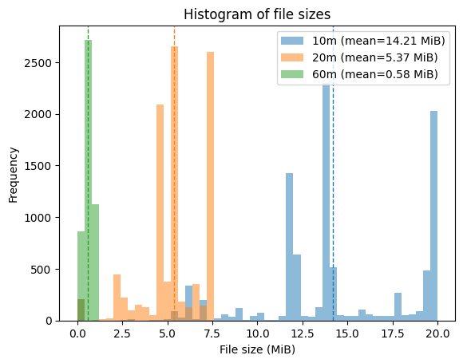

For CSC Allas S3 default project quotas 10 TiB, 1000 buckets, and 500k objects **a sensible organization is to store in each bucket a single tile over all years**. This enables storing a single tile over 20 years or estimated 3.84 TiB, 490k files. It would be simple to increase the Zarr time chunk size from 10 to 20 to approximately halve the number of files. This would also improve the copy time to NVMe. It might even be reasonable to increase time chunk size to 40. The size would likely stay the same and therefore only about 4 tiles could be stored over 10 years, altogether an estimated 8 Tib just under the default Allas quotas. Finland including associated sea areas are covered by a total of 77 tiles which would require about 150 TiB over 10 years. This includes 100% cloudy images. The decision on whether to enforce a cloud percentage threshold can be postponed to after initial training runs with a small number of tiles, as such filtering of the training data would also bias generative modeling results.

### Patch time series load time, Zarr time chunk sizes 20, 40, 80 (April 29, 2025)

These results were with an inefficient sync Zarr ZipStore.

Compared to Zarr with a time chunk size of 10 for all bands, time chunk sizes 20, 40, 80 reduce the number of small files but for low resolutions the files are disproportionally small in size. There are not that many of those files so it might not be a big problem. The small size might actually be beneficial when still updating the Zarr.

```mermaid
---
config:
    xyChart:
        width: 900
        height: 600
    themeVariables:
        xyChart:
            backgroundColor: "#000"
            titleColor: "#fff"
            xAxisLabelColor: "#fff"
            xAxisTitleColor: "#fff"
            xAxisTickColor: "#fff"
            xAxisLineColor: "#fff"
            yAxisLabelColor: "#fff"
            yAxisTitleColor: "#fff"
            yAxisTickColor: "#fff"
            yAxisLineColor: "#fff"
            plotColorPalette: "#f888, #000"
---
xychart-beta
    title "Sentinel 2 L1C patch time series — CSC Puhti compute node"
    x-axis ["Allas S3 COG", "Allas S3 Zarr", "/scratch COG", "/scratch Zarr", "NVMe COG", "NVMe Zarr"]
    y-axis "Mean load time (s)" 0 --> 200
    bar [99.8, 8.72, 381, 9.6, 15.4, 1.07]
    bar [0, 0, 0, 0, 0, 0, 0, 0, 0]
```

The times in seconds were Allas S3: 99.8, 8.72; /scratch: 381, 9.6; NVMe: 15.4, 1.07.

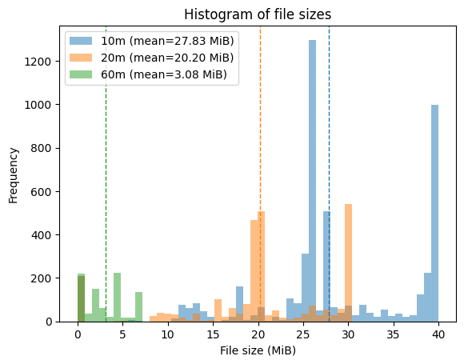

### Zarr and sync zipped Zarr patch time series load time, Zarr time chunk sizes 20, 40, 80 (May 12, 2025)

These results were with an inefficient sync Zarr ZipStore.

```mermaid
---
config:
    xyChart:
        width: 900
        height: 600
    themeVariables:
        xyChart:
            backgroundColor: "#000"
            titleColor: "#fff"
            xAxisLabelColor: "#fff"
            xAxisTitleColor: "#fff"
            xAxisTickColor: "#fff"
            xAxisLineColor: "#fff"
            yAxisLabelColor: "#fff"
            yAxisTitleColor: "#fff"
            yAxisTickColor: "#fff"
            yAxisLineColor: "#fff"
            plotColorPalette: "#f888, #000"
---
xychart-beta
    title "Sentinel 2 L1C patch time series — CSC Puhti compute node"
    x-axis ["Allas S3 Zarr", "Allas S3 zipped Zarr", "NVMe Zarr", "NVMe zipped Zarr"]
    y-axis "Mean load time (s)" 0 --> 26
    bar [7.53, 23.9, 1.12, 3.21]
    bar [0, 0, 0, 0]
```

The times in seconds were: Allas S3 Zarr: 7.53, Allas S3 zipped Zarr: 23.9, NVMe Zarr: 1.12, NVMe zipped Zarr: 3.21.

### Zarr and async zipped Zarr patch time series load time, Zarr time chunk sizes 20, 40, 80 (May 19, 2025)

This benchmark result was obtained after switching to a custom async filesystem for reading zip contents. Also, Zarr stores in the benchmark were made persistent to remove the overhead opening a zipped Zarr.

```mermaid
---
config:
    xyChart:
        width: 900
        height: 600
    themeVariables:
        xyChart:
            backgroundColor: "#000"
            titleColor: "#fff"
            xAxisLabelColor: "#fff"
            xAxisTitleColor: "#fff"
            xAxisTickColor: "#fff"
            xAxisLineColor: "#fff"
            yAxisLabelColor: "#fff"
            yAxisTitleColor: "#fff"
            yAxisTickColor: "#fff"
            yAxisLineColor: "#fff"
            plotColorPalette: "#f888, #000"
---
xychart-beta
    title "Sentinel 2 L1C patch time series — CSC Puhti compute node"
    x-axis ["Allas S3 Zarr", "Allas S3 zipped Zarr (async)", "NVMe Zarr", "NVMe zipped Zarr (async)"]
    y-axis "Mean load time (s)" 0 --> 8
    bar [7.670729303359986, 7.079422011375427, 1.1930245089530944, 1.3410639023780824]
    bar [0, 0, 0, 0]
```

The times in seconds were: Allas S3 Zarr: 7.67, Allas S3 zipped Zarr (async): 7.08, NVMe Zarr: 1.19, NVMe zipped Zarr (async): 1.34.

After the last benchmark run, Zarr time label chunk size, which was found to be 1 by default (due to appending single images to the store) was also increased. No benchmarking results are available yet for this change. The histogram of Zarr file sizes shows that the neary-zero-size files are now gone:

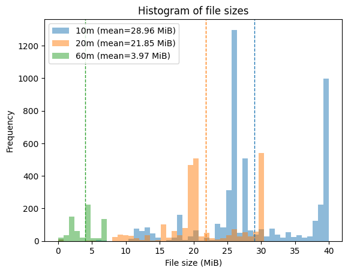

### Summary and conclusions

Because Zarr was much faster than SAFE or COG in initial benchmarks, only the Zarr and zipped Zarr tracks have received further optimizations. The fact that we are aiming at loading patch time series makes SAFE and COG less useful for us, so it is unlikely that we will investigate further SAFE/COG optimizations.

A single tile-year (35VLH, 2024) has the following number of files (command `tree`), total size (command `du -h --apparent-size –s .`), and measured action timings on CSC Puhti (/scratch is a network drive, NVMe is a local drive):

|Format|Files|Size (GiB)|Time (minutes)|Action|From|To|
|-|-|-|-|-|-|-|
|SAFE|13332|115|24|Copy|/scratch|NVMe|
|COG|768|200|11|Copy|/scratch|NVMe|
|Zarr 10*|24487|192|71|Copy|/scratch|NVMe|
|Zarr 20, 40, 80*|8562|192|30|Copy|/scratch|NVMe|
|same as above|||27|Copy|Allas S3|NVMe|
|Zipped Zarr 20, 40, 80*|1|192|10|Copy|/scratch|NVMe|
|same as above|||12|Copy|Allas S3|NVMe|
|same as above|||14|Unzip|NVMe|NVMe|

*) "Zarr 10" and "Zarr 20, 40, 80" (current configuration) refer to the two time chunking cases below.

The chart below (calculated with `throughput.ods`) summarizes the results using CSC Allas and compute node NVMe (with Zarr using the 20, 40 80 time chunking) for machine learning training steps determined by data load times:

```mermaid
---
config:
    xyChart:
        width: 900
        height: 300
    themeVariables:
        xyChart:
            backgroundColor: "#000"
            titleColor: "#fff"
            xAxisLabelColor: "#fff"
            xAxisTitleColor: "#fff"
            xAxisTickColor: "#fff"
            xAxisLineColor: "#fff"
            yAxisLabelColor: "#fff"
            yAxisTitleColor: "#fff"
            yAxisTickColor: "#fff"
            yAxisLineColor: "#fff"
            plotColorPalette: "#48f8, #000"
---
xychart-beta horizontal
    x-axis ["S3 Zarr", "S3 Zarr → NVMe Zarr", "S3 zipped Zarr", "S3 zipped Zarr → NVMe zipped Zarr", "S3 zipped Zarr → NVMe zipped Zarr → NVMe Zarr"]
    y-axis "ML training throughput (5-year patch time series / 3 days of compute)" 4000 --> 45000
    bar [6758.1579208241, 39378.9060052304, 7322.6316946076, 37045.2145583096, 41340.3074537667]
    bar [0, 0, 0, 0, 0, 0]
```

The estimated throughputs are 6758, 39379, 7323, 37045, 41340 5-day patch time series per 3 days of computation (maximum job run time at CSC Puhti), with any initial copying or unzipping reducing the time spent in actual training and thus reducing the estimated throughput. The highest throughputs are obtained by storing Zarr or zipped Zarrs in Allas S3, and copying or optionally unzipping the Zarr or zipped Zarr to local NVMe in the beginning of the training run.

The zipped Zarr results in the above were obtained using a custom async fsspec file system for the files in a zip located in another async fsspec file system. This reduced load times three-fold compared to using the ZipStore of zarr 3.0.7 based on sync ZipFile. Because choosing between Zarr and zipped Zarr is hot topic and zipped Zarr v3 [might also be](https://cpm.pages.eopf.copernicus.eu/eopf-cpm/main/PSFD/4-storage-formats.html) ESA's future dissemination format for satellite images, I advertised the solution in a few places, [in a discussion](https://github.com/zarr-developers/zarr-python/discussions/1613) in the Zarr Python repo on zipped Zarr and S3, in [Pangeo Discourse](https://discourse.pangeo.io/t/whats-the-best-file-format-to-chose-for-raster-imagery-and-masks-products/4555), and in [an issue](https://github.com/csaybar/ESA-zar-zip-decision/issues/6) on a position piece opposing zipping of Zarrs for satellite image dissemination (see the last link also for interesting ideas for improving SAFE and COG patch load times).

Streaming unzipping from S3 to NVMe instead of copying and unzipping has not yet been tested.

## Authors

Olli Niemitalo (Olli.Niemitalo@hamk.fi), Otto Rosenberg

## License

Licensed under the MIT license. We are probably happy to help if you need a different open license.

## Copyright

Copyright 2025 HAMK Häme University of Applied Sciences

## Acknowledgements

The work was supported by the Research Council of Finland funding decision 353076, Digital solutions to foster climate-smart agricultural transition (Digi4CSA). Development and testing were partially done on the CSC – IT Center for Science, Finland supercomputer Puhti.
